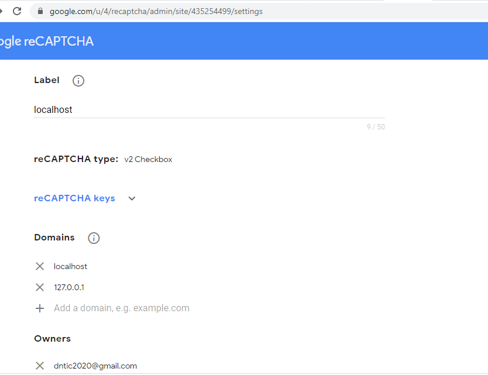

## PASO 1:

```sh
composer create-project laravel/laravel recaptcha28nov2020 "6.*"
```

```sh
composer require anhskohbo/no-captcha
```

## PASO 2:

Modificar ``config/app.php``

## PASO 3:

Get Google Captcha Secrets: 
Registra un sitio nuevo > localhost > reCAPTCHA v2 > "I'm not a robot" Checkbox

https://www.google.com/recaptcha/admin/create
EMAIL:
dntic2020@gmail.com
KEYS:
CLIENT-SIDE:
6LfjdPEZAAAAADBVkvNYSAt6ZUJM8-ikB1x5omgt
SERVER-SIDE:
6LfjdPEZAAAAAPo-TA0-h-RC5QvZvKBFsG0wMppb

Agregar dominio local:




## ERROR

GuzzleHttp\Exception\RequestException
cURL error 60: SSL certificate problem: unable to get local issuer certificate (
    
https://github.com/guzzle/guzzle/issues/1935

Download the latest cacert.pem from https://curl.haxx.se/ca/cacert.pem
Add the following line to php.ini:
curl.cainfo="/path/to/downloaded/cacert.pem"
Ej: curl.cainfo = C:\php72\cacert.pem

## REFERENCIAS

https://xpertphp.com/laravel-6-google-v2-recaptcha-form-validation-example-tutorial/
https://www.tutsmake.com/laravel-7-6-google-v2-recaptcha-form-validation-example/
https://medium.com/@samuelhenshaw2020/recaptcha-v2-in-angular-8-with-back-end-verification-with-nodejs-9574f297fdef
https://javorovic.com/blog/add-google-recaptcha-php-laravel